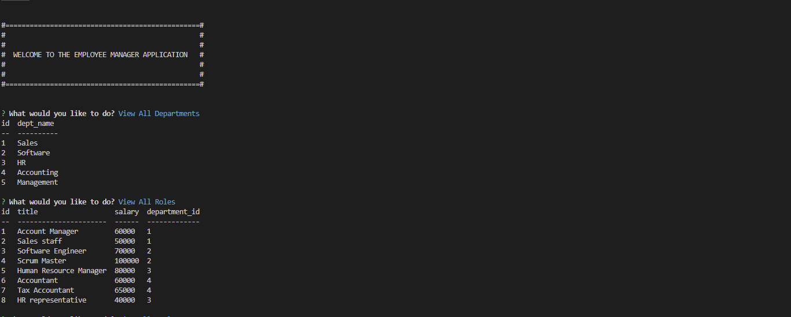

  # mysql-employee-manager

   [](https://opensource.org/licenses/MIT)
  
  ## Table of Contents 

  * [Description](#description)
  
  * [Installation](#installation)
  
  * [Usage](#usage)

  * [Screenshot](#screenshot)
  
  * [Contributing](#contributing)
  
  * [License](#license)

  * [Questions](#questions)

  ## Description

  The employee manager application is created in node.js and uses mysql backend. Users are able to input new departments, roles, and employees. 
  You will also be able to view these tables that you have to track employees and their roles and departments. This project uses npm packages like 
  mysql2, and inquirer to get user input into a relational database. The main menu is controled by a conditional switch statement that manages what the 
  user selects and what functions to run. Inside these various functions are quieries executing selects and update sql statements to retieve and send information.

  ## Screenshot
  
  []
  
  ## Installation 

  To install the necessary dependencies, run the following command:
  
  ```Dependencies
   npm i
  ```  
  ## Usage

  You will need to run node server.js to run this application. There are some starter code for the sql database in the seeds and schema sql files. 
  
  ## Contributing

  Fork it to your own repo is you would like to contribute. There is still need for different data to show in tables as well as ways to delete 
  data.

  ## License

  This project is licensed under the MIT license 

  ## Questions
  
  If you have any questions about the repo, open an issue contact me directly at [midth002@gmail.com](mailto:midth002@gmail.com). You can find more work at [midth002](https://github.com/midth002)
  
  
